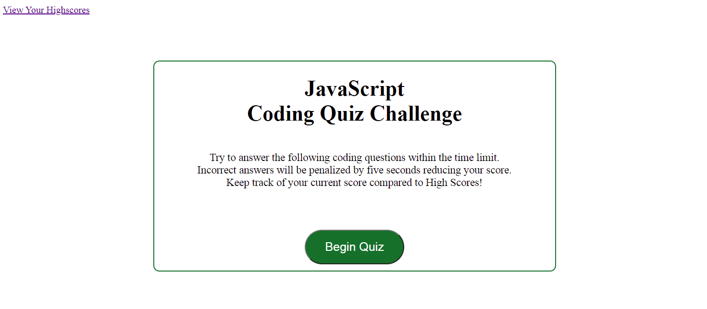

# 04 Web APIs: Code Quiz

# OBJECTIVE:
* To create a code quiz with multiple choice questions based on the fundamentals of JavaScript.
* This is to be a timed event with multiple questions asked and your score is based on the time remaining after answering all the questions.
* Time begins when a start button is depressed and penalties are accessed for incorrect answers by deducting time from the timer.
* Correct answers are displayed after the selection is made from a list of answers.
* Upon completion the final score is to be stored and compared to high scores from previous tests.
* The quiz is completed when all questions have been answered or time has expired.

# Steps taken to meet these objectives:
* Initial HTML was written for basic layout of the beginning page.
* Second HTML was written to handle the high score rankings.
* One CSS style sheet was written to handle design and to meet multiple screen sizes.
* JavaScript code was written to ask the questions and give the answers once a selection had been made from the multiple choices.
* A second JavaScript was written to handle the tracking of the high scores.

# Below are the GitHub Pages published link and the GitHub Repository address:

# Here is a screen shot of the webpage when deployed:

